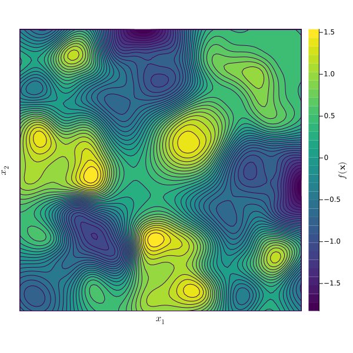
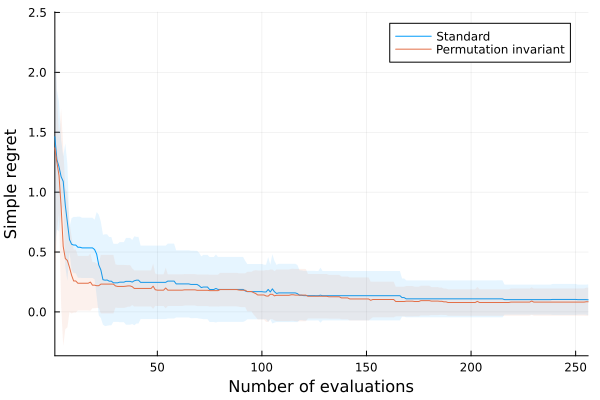
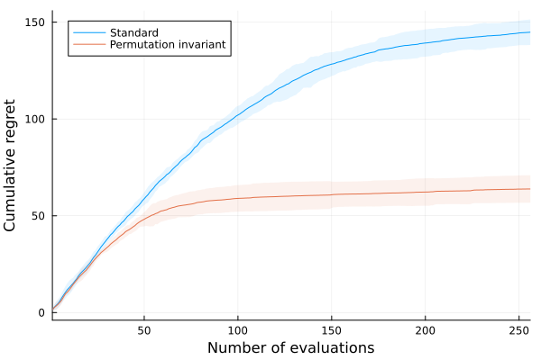
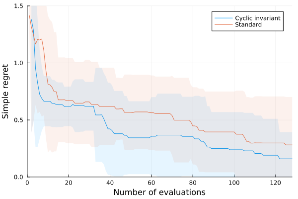
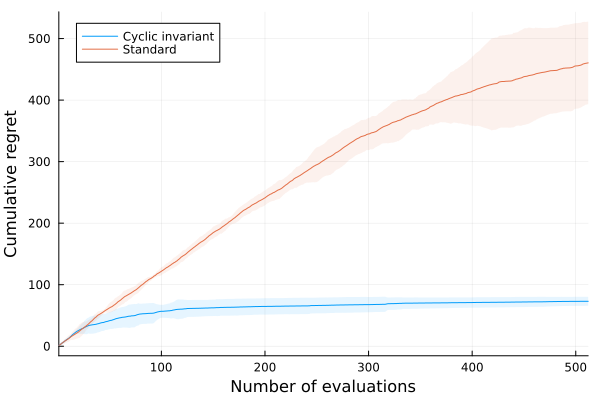

# Experiments

This folder contains the Julia scripts for running the experiments and generating the plots.

### Experiment 1: 2D permutation group

| Target function                                                                                        | MVR [[code](experiment_1_mvr.jl)]                                                       | UCB [[code](experiment_1_ucb.jl)]                                                           |
| ------------------------------------------------------------------------------------------------------ | --------------------------------------------------------------------------------------- | ------------------------------------------------------------------------------------------- |
|  |  |  |

### Experiment 2: 3D cyclic group

| Target function                                                                                   | MVR [[code](experiment_2_mvr.jl)]                                                       | UCB [[code](experiment_2_ucb.jl)]                                                           |
| ------------------------------------------------------------------------------------------------- | --------------------------------------------------------------------------------------- | ------------------------------------------------------------------------------------------- |
|  |  |  |

### Experiment 3: Effect of increasing symmetry

| Target function          | MVR [[code](experiment_3_mvr.jl)]                                                       | UCB [[code](experiment_3_ucb.jl)]                                                           |
| ------------------------ | --------------------------------------------------------------------------------------- | ------------------------------------------------------------------------------------------- |
| 6D permutation invariant |  |  |
