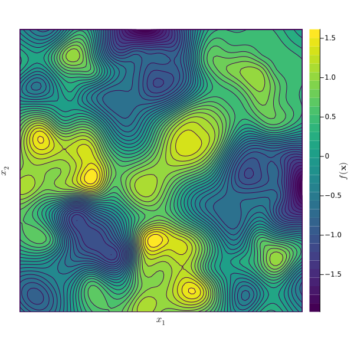
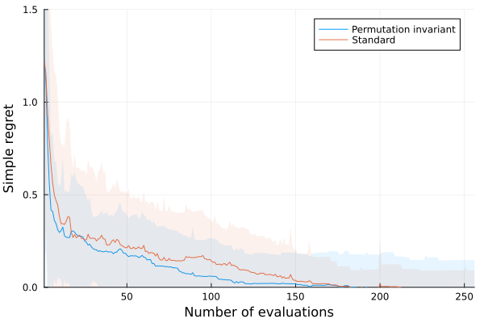
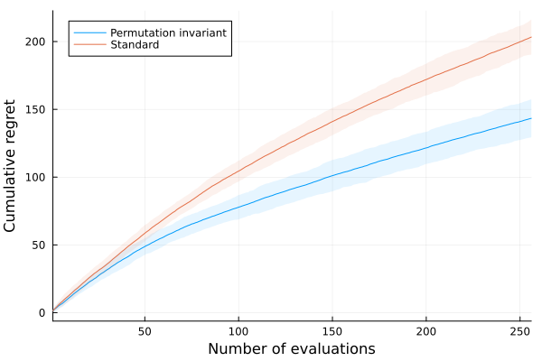
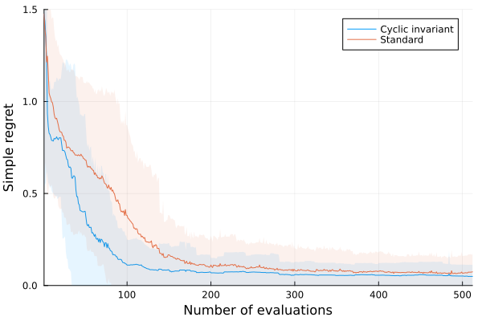
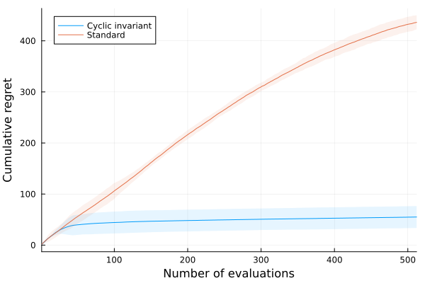
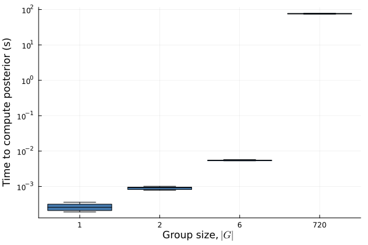
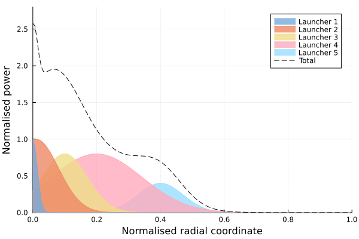

# Experiments

This folder contains the scripts for running the experiments and generating the plots.

## Synthetic

### Experiment 1: 2D permutation group

| Target function                                                                                                  | MVR [[code](synthetic/experiment_1_mvr.jl)]                                                       | UCB [[code](synthetic/experiment_1_ucb.jl)]                                                           |
| ---------------------------------------------------------------------------------------------------------------- | ------------------------------------------------------------------------------------------------- | ----------------------------------------------------------------------------------------------------- |
|  |  |  |

### Experiment 2: 3D cyclic group

| Target function                                                                                             | MVR [[code](synthetic/experiment_2_mvr.jl)]                                                       | UCB [[code](synthetic/experiment_2_ucb.jl)]                                                           |
| ----------------------------------------------------------------------------------------------------------- | ------------------------------------------------------------------------------------------------- | ----------------------------------------------------------------------------------------------------- |
|  |  |  |

### Experiment 3: Effect of increasing symmetry

| Target function          | MVR [[code](synthetic/experiment_3_mvr_mpi.jl)]                                                       | UCB [[code](synthetic/experiment_3_ucb_mpi.jl)]                                                           |
| ------------------------ | ----------------------------------------------------------------------------------------------------- | --------------------------------------------------------------------------------------------------------- |
| 6D permutation invariant |  |  |

#### Computational cost

## Cache model

Coming soon

## Nuclear fusion scenario design

| Input visualisation                                                             | Results     |
| ------------------------------------------------------------------------------- | ----------- |
|  | Coming soon |
